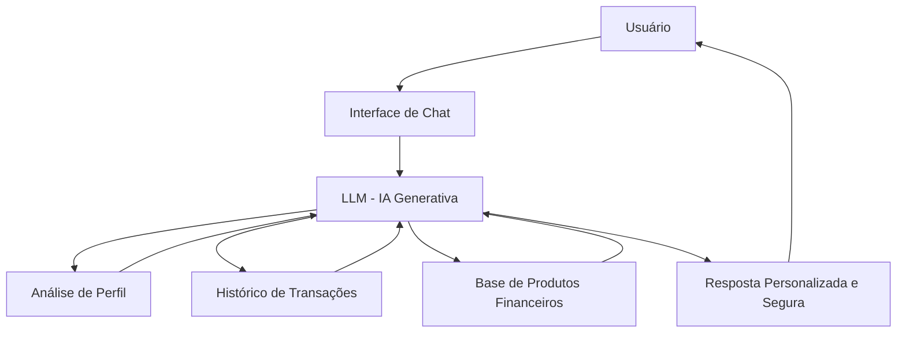

# 🤖 Clara - Agente Financeira Inteligente com IA Generativa

## 📌 Sobre o Projeto

A **Clara** é uma agente financeira inteligente desenvolvida com IA Generativa, projetada para atuar de forma **consultiva, personalizada e segura** no apoio a decisões financeiras.

Diferente de chatbots reativos, a Clara:

- 🔎 Analisa histórico financeiro
- 📊 Considera perfil de investidor
- 💡 Sugere estratégias personalizadas
- ⚠️ Evita recomendações incompatíveis com o perfil do cliente
- 🛡️ Minimiza alucinações com base estruturada de conhecimento

---

## 🎯 Problema Resolvido

Muitos clientes:
- Não sabem como investir
- Tomam decisões sem considerar seu perfil de risco
- Não possuem acompanhamento financeiro personalizado

A Clara atua como uma **consultora financeira digital**, oferecendo recomendações baseadas em dados e contexto.

---

## 🧠 Arquitetura da Solução

## Link do Vídeo

> Clique aqui para assistir ao pitch da Clara:
[▶️ Assistir ao vídeo](./Pitch_Clara_.mp4)
